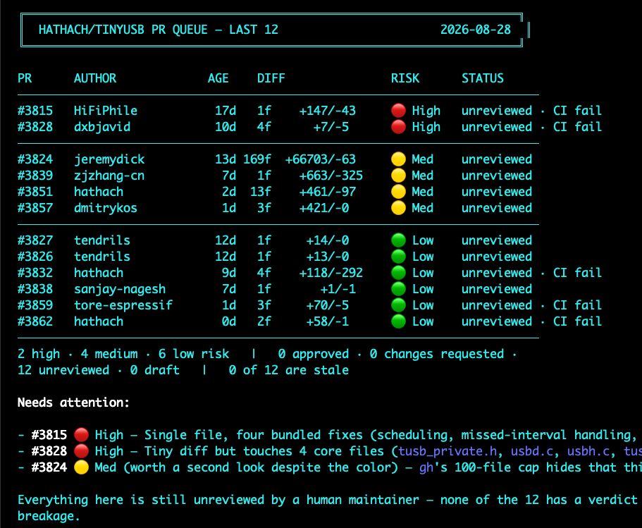

# PR Queue View

A one-screen, risk-colored read of a GitHub repo's open pull request queue.
Point this file at a repo link and Claude will pull every open PR, score
each one on five concerns, and render a single dashboard sorted worst-first
so you know which PRs deserve a close read before opening any of them.



This is a **read-only reconnaissance pass**. It never approves, merges,
closes, or comments — it's the filter that decides where to look harder,
not a substitute for actually reading a flagged PR.

## How to use this

Paste this file into a Claude conversation (or point Claude at its raw URL)
along with a repo link:

> Run pr-queue-view.md against `https://github.com/<owner>/<repo>/pulls`

Optional filters: a window ("last 12 PRs", "opened in the last 7 days"), a
state (defaults to `open`), or a staleness threshold (defaults to 180 days
since the last maintainer review activity).

## The five concerns

Score every PR on these five, individually, before rolling up to one
overall risk color. A PR can be 🟢 on four and 🔴 on one — that one is
exactly what matters, so the overall score is the **worst of the five,
not an average**.

1. **Size** — is the diff proportional to the stated problem? A one-line
   fix with a 40-line diff is a flag; a big diff with a big, well-scoped
   problem is not automatically one.
2. **Files touched** — how many, and do any fall in the repo's core/shared
   paths (the directories where a bug has the widest blast radius, as
   opposed to one driver/board/module/doc)? This is repo-specific — infer
   it from the repo's layout (e.g. a `core/`, `src/`, or `lib/` tree that
   fans out to everything else) or ask if it isn't obvious.
3. **APIs / interfaces** — does it reuse the established interface or
   convention for this subsystem, or invent something novel? When unsure,
   pull a couple of recently merged PRs touching the same area and compare:
   ```sh
   gh pr list --repo <owner/repo> --state merged --search "path:<dir>" --limit 5
   ```
   Novel isn't automatically wrong — sometimes the existing convention is
   what's wrong — but it's a flag either way, worth naming.
4. **Tested** — read the PR body specifically for this. Did the author
   state what they ran and what passed, or is there no testing claim at
   all? For hardware/firmware repos, a real board + firmware version beats
   "compiles clean." Absence of any claim is a flag on a PR that changes
   real runtime behavior.
5. **Single problem** — does the PR do one thing it can explain in a
   sentence, ideally against a real linked issue? Or is it a grab-bag —
   an unrelated refactor riding along with a feature, multiple unrelated
   fixes in one diff? Grab-bags are a flag independent of how good any
   individual piece is, because they're harder to revert cleanly and
   harder to review at all.

## Step 1 — Pull the queue

```sh
gh pr list --repo <owner/repo> --state open --limit 300 \
  --json number,title,author,createdAt,additions,deletions,changedFiles,isDraft
```

## Step 2 — Per-PR signal

```sh
gh pr view <number> --repo <owner/repo> \
  --json files,reviews,statusCheckRollup,body,createdAt,mergeable
```

Pull out, specifically for the five concerns above:

- Files touched, cross-referenced against the repo's core-path list.
- Diff size versus what the body claims to be fixing.
- The body text, read for a testing claim and for whether it describes
  one problem or several.
- **Review state**: latest verdict per human reviewer (bot reviews like
  Copilot/CodeQL/Claude are signal but not a maintainer verdict — say so
  rather than counting them as "approved").
- **CI status**: failing checks, and whether the failure looks caused by
  this PR specifically or is broad/pre-existing noise (a check failing
  identically across nearly every open PR is infra, not this PR's fault;
  a check failing only for this PR, or across many board/target builds it
  specifically touches, is a real signal).
- **Age**: days since `createdAt`, and days since the *last* review
  activity — a PR can be old but freshly reviewed, that's not stale.

STATUS is the shortest true thing: `✅ approved`, `changes req.`,
`in review` (active back-and-forth, no verdict yet), `unreviewed`,
`draft`. Append `· CI fail` if a check fails for a reason that isn't
obvious noise, and `(stale)` if there's been no maintainer review
activity past the staleness threshold — independent of risk; a stale
🟢 is worth flagging too, for a different reason (cheap to close/merge
and nobody has).

## Step 3 — Render

Sort worst-first: overall risk descending, then age descending within
each tier (oldest first, to surface the backlog and not just what's
scary).

```
  ╔══════════════════════════════════════════════════════════════════════╗
  ║  <OWNER/REPO> PR QUEUE                                  <YYYY-MM-DD>  ║
  ╚══════════════════════════════════════════════════════════════════════╝

  PR       AUTHOR             AGE    DIFF              RISK      STATUS
  ────────────────────────────────────────────────────────────────────────
  #10283   rianadon          491d   13f    +517/-1     🔴 High   changes req.
  #11189   lynt-smitka        16d    1f     +68/-2     🟢 Low    ✅ approved
  ────────────────────────────────────────────────────────────────────────
  N low · N medium · N high risk   |   N approved · N changes requested ·
  N in review · N unreviewed · N draft   |   N of TOTAL are stale (>180d)
```

Below the table, a "Needs attention" list — every overall 🔴, plus any
stale row regardless of color — naming the *specific* concern(s) that
tripped it, not just the color:

```
Needs attention:
  #10283  🔴 High   Files/blast-radius: 12 files in shared-bindings/.
                    Tested: no claim in body — compile-tested only?
                    Changes requested 491 days ago, idle since.
  #10320  🟢 Low    Single problem: board-def only, narrow. Flagged only
                    for staleness — 476 days, zero reviews.
```

## Going deeper

When a flagged PR needs more than this table — a full diff read, the
review thread, or a drafted (never sent) reply — that's a separate,
deeper pass: pull the full body and diff, verify any large file count
against `gh`'s 100-file cap on `--json files` (paginate the REST API if
`changedFiles` exceeds 100 — the cap silently hides files, which can hide
exactly the shared-code touch that matters), and read the actual diff
before trusting a summary. Never run `gh pr comment`, `gh pr review`,
`gh pr close`, or `gh pr merge` as part of either pass — draft replies
for a human to read and send, don't post them.
